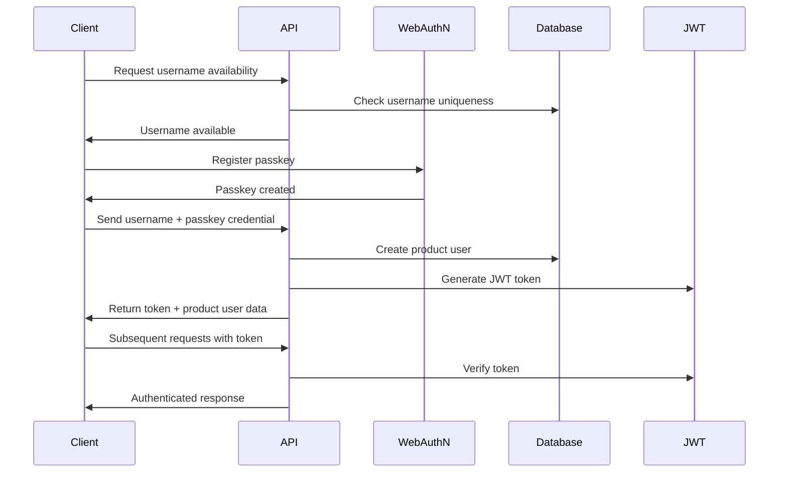

# Sprint Change Proposal: Authentication Pivot to Passkey-Based System

**Date:** December 19, 2024  
**Proposed by:** Sarah (Product Owner)  
**Status:** ✅ **APPROVED** - December 19, 2024

## Executive Summary

This proposal outlines a significant architectural change to pivot from SMS-based authentication to passkey-based authentication using WebAuthN. This change will eliminate third-party dependencies, improve security, enhance user experience, and reduce operational costs while maintaining the same core MVP functionality.

## Analysis Summary

### Original Issue

The current authentication design uses SMS OTP with phone numbers as unique identifiers. Research has revealed that passkey-based authentication using WebAuthN would be superior, providing:

- **No third-party dependency** (eliminates Twilio costs and complexity)
- **Better security** (public key cryptography vs SMS)
- **Simpler user experience** (no phone number entry, no SMS codes)
- **More reliable** (no SMS delivery issues)

### Impact Analysis

- **Epic 1:** No impact (foundation work complete)
- **Epic 2:** Major restructuring required - Stories 2.1 & 2.2 need complete rewrite
- **Epic 3:** No impact (workout execution unchanged)
- **Epic 4:** No impact (advanced features unchanged)

### Artifact Conflicts Identified

9 major artifacts require updates, including PRD requirements, tech stack, architecture documents, collection schemas, server actions, type definitions, and Epic 2 stories.

## Recommended Path Forward

**Selected Approach:** Direct Adjustment / Integration

**Rationale:**

1. Better user experience with modern authentication
2. Simplified architecture without third-party dependencies
3. Cost reduction (no SMS fees)
4. Future-proof technology choice
5. Manageable effort (8-12 days total)
6. No rollback needed (pivoting before implementation)
7. Improves MVP without changing scope

## Implementation Plan

### Phase 1: Foundation Updates (2-3 days)

- Update ProductUsers collection schema
- Update type definitions
- Update configuration files
- Remove Twilio dependencies

### Phase 2: WebAuthN Implementation (3-4 days)

- Implement WebAuthN server actions
- Create passkey registration flow
- Create passkey authentication flow
- Update authentication middleware

### Phase 3: UI/UX Updates (2-3 days)

- Redesign authentication components
- Update route structure
- Implement username input and validation
- Create passkey registration interface

### Phase 4: Cleanup and Testing (1-2 days)

- Remove Twilio integration
- Update documentation
- Comprehensive testing
- Environment configuration

## Specific Proposed Edits

### 1. PRD Requirements Updates

**File:** `docs/prd/requirements.md`

**Change FR1 from:**

```
**FR1:** The system shall provide SMS OTP authentication for product users using phone numbers as unique identifiers.
```

**To:**

```
**FR1:** The system shall provide passkey-based authentication for product users using globally unique usernames as identifiers.
```

**Change FR2 from:**

```
**FR2:** The system shall support two distinct user types: Admin users (PayloadCMS built-in) and Product users (custom collection with SMS authentication).
```

**To:**

```
**FR2:** The system shall support two distinct user types: Admin users (PayloadCMS built-in) and Product users (custom collection with passkey authentication).
```

**Change NFR7 from:**

```
**NFR7:** The system shall implement secure phone number storage and SMS OTP validation.
```

**To:**

```
**NFR7:** The system shall implement secure username storage and WebAuthN passkey validation.
```

**Change NFR12 from:**

```
**NFR12:** The system shall aim to stay within free/low-cost service limits (SMS services, hosting).
```

**To:**

```
**NFR12:** The system shall aim to stay within free/low-cost service limits (hosting only - no third-party authentication services).
```

### 2. Tech Stack Updates

**File:** `docs/architecture/tech-stack.md`

**Change line 19 from:**

```
| Authentication       | Twilio SMS OTP                  | Latest   | Phone-based auth                  | Simple, secure authentication without password management                |
```

**To:**

```
| Authentication       | WebAuthN/FIDO2                  | Latest   | Passkey-based auth                | Simple, secure authentication without password management                |
```

### 3. Backend Architecture Updates

**File:** `docs/architecture/backend-architecture.md`

**Replace the entire Authentication Architecture section (lines 172-243) with:**

````markdown
## Authentication Architecture

### Auth Flow


````

### WebAuthN Integration

```typescript
import {
  generateRegistrationOptions,
  verifyRegistrationResponse,
  generateAuthenticationOptions,
  verifyAuthenticationResponse,
} from '@simplewebauthn/server'

export async function registerPasskey(username: string, credential: any) {
  const payload = await getPayload()

  // Create product user with username
  const productUser = await payload.create({
    collection: 'productUsers',
    data: {
      username,
      passkeyCredentials: [credential],
    },
  })

  return { success: true, productUser }
}

export async function authenticateWithPasskey(username: string, credential: any) {
  const payload = await getPayload()

  // Find user by username
  const result = await payload.find({
    collection: 'productUsers',
    where: { username: { equals: username } },
    limit: 1,
  })

  const productUser = result.docs[0]
  if (!productUser) {
    throw new Error('User not found')
  }

  // Verify passkey credential
  const verification = await verifyAuthenticationResponse({
    response: credential,
    expectedChallenge: expectedChallenge,
    expectedOrigin: process.env.NEXT_PUBLIC_APP_URL,
    expectedRPID: process.env.WEBAUTHN_RP_ID,
    authenticator: productUser.passkeyCredentials[0],
  })

  if (verification.verified) {
    const token = signJWT({ productUserId: productUser.id })
    return { success: true, productUser, token }
  }

  throw new Error('Authentication failed')
}
```

### Middleware/Guards

```typescript
import jwt from 'jsonwebtoken'
import { NextApiRequest, NextApiResponse } from 'next'
import { ProductUser } from '@/types'

interface AuthRequest extends NextApiRequest {
  productUser?: ProductUser
}

export const authMiddleware = async (
  req: AuthRequest,
  res: NextApiResponse,
): Promise<ProductUser | null> => {
  try {
    const token = req.headers.authorization?.replace('Bearer ', '')

    if (!token) {
      return null
    }

    const decoded = jwt.verify(token, process.env.JWT_SECRET!) as any
    const payload = await getPayload()

    const productUser = await payload.findByID({
      collection: 'productUsers',
      id: decoded.productUserId,
    })

    if (!productUser) {
      return null
    }

    req.productUser = productUser
    return productUser
  } catch (error) {
    return null
  }
}

export const requireAuth = (handler: Function) => {
  return async (req: AuthRequest, res: NextApiResponse) => {
    const productUser = await authMiddleware(req, res)

    if (!productUser) {
      return res.status(401).json({ error: 'Unauthorized' })
    }

    return handler(req, res)
  }
}
```

````

### 4. ProductUsers Collection Updates

**File:** `src/payload/collections/product-users.ts`

**Replace the entire file with:**

```typescript
import type { CollectionConfig } from 'payload'

export const ProductUsers: CollectionConfig = {
  slug: 'productUsers',
  admin: {
    useAsTitle: 'username',
    defaultColumns: [
      'username',
      'displayName',
      'currentProgram',
      'currentMilestone',
      'currentDay',
    ],
    description:
      'Product users are app users who authenticate via WebAuthN passkeys. They are completely separate from admin users.',
  },
  access: {
    // Only authenticated admin users can manage product users
    create: ({ req: { user } }) => Boolean(user),
    read: ({ req: { user } }) => Boolean(user),
    update: ({ req: { user } }) => Boolean(user),
    delete: ({ req: { user } }) => Boolean(user),
  },
  fields: [
    {
      name: 'username',
      type: 'text',
      required: true,
      unique: true,
      index: true,
      admin: {
        description:
          'Globally unique username for passkey authentication. Must be unique across all product users.',
      },
      validate: (value: string | null | undefined) => {
        if (!value || typeof value !== 'string') {
          return 'Username is required'
        }

        // Username validation: 3-20 characters, alphanumeric and underscores only
        if (value.length < 3 || value.length > 20) {
          return 'Username must be between 3 and 20 characters'
        }

        if (!/^[a-zA-Z0-9_]+$/.test(value)) {
          return 'Username can only contain letters, numbers, and underscores'
        }

        return true
      },
    },
    {
      name: 'displayName',
      type: 'text',
      admin: {
        description:
          'Optional display name for the user. If not provided, username will be used.',
      },
    },
    {
      name: 'passkeyCredentials',
      type: 'array',
      fields: [
        {
          name: 'credentialID',
          type: 'text',
          required: true,
        },
        {
          name: 'publicKey',
          type: 'text',
          required: true,
        },
        {
          name: 'counter',
          type: 'number',
          required: true,
        },
        {
          name: 'deviceType',
          type: 'text',
        },
        {
          name: 'backedUp',
          type: 'checkbox',
          defaultValue: false,
        },
        {
          name: 'transports',
          type: 'array',
          fields: [
            {
              name: 'transport',
              type: 'text',
            },
          ],
        },
      ],
      admin: {
        description: 'WebAuthN passkey credentials for this user.',
      },
    },
    {
      name: 'currentProgram',
      type: 'relationship',
      relationTo: 'programs',
      admin: {
        description: 'The program the user is currently enrolled in.',
      },
    },
    {
      name: 'currentMilestone',
      type: 'relationship',
      relationTo: 'milestones',
      admin: {
        description: 'The current milestone within the program.',
      },
    },
    {
      name: 'currentDay',
      type: 'number',
      defaultValue: 1,
      min: 1,
      admin: {
        description: 'The current day number within the milestone (1-based).',
      },
    },
    {
      name: 'lastWorkoutDate',
      type: 'date',
      admin: {
        description: 'Date of the last completed workout.',
      },
    },
    {
      name: 'totalWorkoutsCompleted',
      type: 'number',
      defaultValue: 0,
      min: 0,
      admin: {
        description: 'Total number of workouts completed by this user.',
      },
    },
  ],
}
````

### 5. Epic 2 Story Updates

**File:** `docs/prd/epic-2-user-authentication-program-access.md`

**Update Epic Goal from:**

```
**Epic Goal:** Implement SMS OTP authentication for product users and create the program selection interface that allows users to access available workout programs. This epic delivers the complete user authentication flow and program access functionality, enabling users to securely log in and select their desired workout programs before beginning workout sessions.
```

**To:**

```
**Epic Goal:** Implement passkey-based authentication for product users and create the program selection interface that allows users to access available workout programs. This epic delivers the complete user authentication flow and program access functionality, enabling users to securely log in and select their desired workout programs before beginning workout sessions.
```

**Replace Story 2.1 entirely:**

```markdown
## Story 2.1: Passkey Authentication System

As a **product user**,
I want **to authenticate using a username and passkey**,
so that **I can securely access the workout app without complex password management or SMS dependencies**.

### Acceptance Criteria

1. **Username input screen** accepts valid usernames with proper formatting and validation
2. **Username availability check** verifies username uniqueness before registration
3. **Passkey registration** allows users to create passkeys using WebAuthN
4. **Passkey authentication** enables secure login using registered passkeys
5. **User session management** maintains authenticated state across app usage
6. **Username storage** securely stores user usernames as unique identifiers
7. **Passkey credential storage** securely stores WebAuthN credentials
8. **Rate limiting** prevents abuse of the authentication system
9. **Error handling** provides clear feedback for invalid usernames or authentication failures
10. **Mobile optimization** includes touch-friendly interface optimized for mobile devices
11. **Security measures** implement proper session management and data protection
12. **Browser compatibility** ensures WebAuthN works across supported browsers
```

**Update Story 2.2:**

**Change the story title and description from:**

```
## Story 2.2: Product User Management

As a **system administrator**,
I want **to manage product users and their authentication data**,
so that **I can track user accounts and ensure proper access control**.
```

**To:**

```
## Story 2.2: Product User Management

As a **system administrator**,
I want **to manage product users and their passkey authentication data**,
so that **I can track user accounts and ensure proper access control**.
```

**Update Acceptance Criteria 1 from:**

```
1. **Product users collection** stores phone numbers, authentication status, and user metadata
```

**To:**

```
1. **Product users collection** stores usernames, passkey credentials, authentication status, and user metadata
```

**Update Acceptance Criteria 2 from:**

```
2. **User creation** automatically creates product user records upon successful SMS authentication
```

**To:**

```
2. **User creation** automatically creates product user records upon successful passkey registration
```

**Update Acceptance Criteria 3 from:**

```
3. **User lookup** efficiently finds users by phone number for authentication
```

**To:**

```
3. **User lookup** efficiently finds users by username for authentication
```

**Update Acceptance Criteria 5 from:**

```
5. **Data validation** ensures phone numbers are properly formatted and unique
```

**To:**

```
5. **Data validation** ensures usernames are properly formatted and unique
```

**Update Acceptance Criteria 7 from:**

```
7. **Security compliance** implements proper data protection for phone number storage
```

**To:**

```
7. **Security compliance** implements proper data protection for username and passkey credential storage
```

### 6. Configuration Updates

**File:** `src/lib/config.ts`

**Remove Twilio environment variables and add WebAuthN configuration:**

**Remove lines 45-48:**

```typescript
  // SMS Service
  TWILIO_ACCOUNT_SID: getOptionalEnvVar('TWILIO_ACCOUNT_SID', ''),
  TWILIO_AUTH_TOKEN: getOptionalEnvVar('TWILIO_AUTH_TOKEN', ''),
  TWILIO_PHONE_NUMBER: getOptionalEnvVar('TWILIO_PHONE_NUMBER', ''),
```

**Add after line 44:**

```typescript
  // WebAuthN Configuration
  WEBAUTHN_RP_ID: getEnvVar('WEBAUTHN_RP_ID'),
  WEBAUTHN_RP_NAME: getEnvVar('WEBAUTHN_RP_NAME'),
```

**Update the EnvironmentConfig interface to remove Twilio fields and add WebAuthN fields.**

### 7. Frontend Architecture Updates

**File:** `docs/architecture/frontend-architecture.md`

**Update route structure (lines 142-145) from:**

```
│   ├── login/             # SMS authentication
│   │   └── page.tsx
│   ├── verify/            # OTP verification
│   │   └── page.tsx
```

**To:**

```
│   ├── login/             # Passkey authentication
│   │   └── page.tsx
│   ├── register/          # Username registration & passkey setup
│   │   └── page.tsx
```

**Update server actions export (line 209) from:**

```typescript
export { sendOTP, verifyOTP } from '@/actions/auth'
```

**To:**

```typescript
export { registerPasskey, authenticateWithPasskey } from '@/actions/auth'
```

## Success Criteria

- [ ] All authentication flows use WebAuthN passkeys instead of SMS
- [ ] ProductUsers collection uses username instead of phoneNumber
- [ ] No Twilio dependencies remain in the codebase
- [ ] All documentation reflects passkey authentication
- [ ] Authentication works across supported browsers
- [ ] User experience is improved (no phone number entry, no SMS codes)
- [ ] Security is enhanced (public key cryptography)
- [ ] Operational costs are reduced (no SMS fees)

## Risk Assessment

**Low Risk:**

- WebAuthN has excellent browser support in modern browsers
- Well-established libraries available (@simplewebauthn/server)
- No existing SMS implementation to migrate

**Mitigation Strategies:**

- Comprehensive testing across different browsers
- Fallback documentation for unsupported browsers
- Clear user guidance for passkey setup

## Next Steps

1. **User Approval:** Obtain explicit approval for this Sprint Change Proposal
2. **Architect Review:** Have the Architect review WebAuthN implementation approach
3. **Implementation:** Begin Phase 1 (Foundation Updates)
4. **Testing:** Comprehensive testing of authentication flows
5. **Documentation:** Update all affected documentation

## Agent Handoff Plan

- **PO (Current):** Complete change proposal and story updates ✅
- **Architect:** Review WebAuthN implementation approach and provide technical guidance
- **Developer:** Implement the authentication changes following the phased approach

---

**This Sprint Change Proposal is ready for review and approval.**
