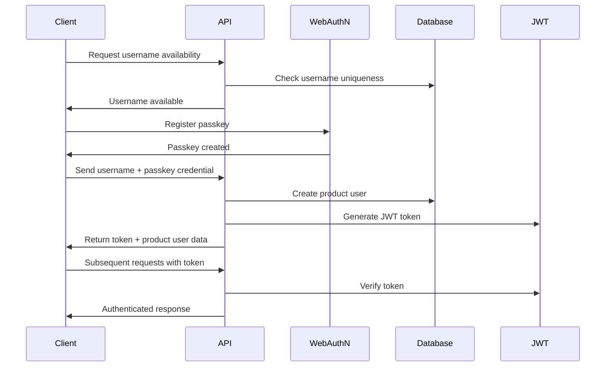

# Backend Architecture

## Service Architecture

### Server Actions Organization

```
src/
├── actions/               # Server actions
│   ├── auth.ts            # Authentication server actions
│   ├── programs.ts        # Program management actions
│   ├── workouts.ts        # Workout execution actions
│   └── exercises.ts       # Exercise management actions
```

### Server Action Template

```typescript
'use server'

import { getPayload } from 'payload'
import { getCurrentUser } from '@/lib/auth'
import { validateData } from '@/lib/validation'
import { revalidatePath } from 'next/cache'

export async function serverActionName(data: ActionData) {
  try {
    // Authentication
    const productUser = await getCurrentProductUser()
    if (!productUser) {
      throw new Error('Unauthorized')
    }

    // Validation
    const validatedData = validateData(data, schema)

    // Business logic
    const payload = await getPayload()
    const result = await payload.create({
      collection: 'collectionName',
      data: validatedData,
    })

    // Revalidate relevant paths
    revalidatePath('/relevant-path')

    return { success: true, data: result }
  } catch (error) {
    console.error('Server Action Error:', error)
    return { success: false, error: error.message }
  }
}
```

## Database Architecture

### PayloadCMS Integration

The backend architecture leverages PayloadCMS's collection system for all data management. All collection definitions are provided in the main "PayloadCMS Collections" section above, which includes:

- Complete collection definitions with proper field types
- Relationship configurations for junction tables
- Field validation and constraints
- Automatic admin interface generation

### PayloadCMS Local API Data Access

```typescript
import { getPayload } from 'payload'

// PayloadCMS Local API provides full type safety automatically
// No need for custom repository classes - use PayloadCMS methods directly

export async function findUserByUsername(username: string) {
  const payload = await getPayload()

  const result = await payload.find({
    collection: 'productUsers',
    where: {
      username: { equals: username },
    },
    limit: 1,
  })

  return result.docs[0] || null
}

export async function createProductUser(productUserData: Partial<ProductUser>) {
  const payload = await getPayload()

  return await payload.create({
    collection: 'productUsers',
    data: productUserData,
  })
}

export async function updateProductUserProgress(
  productUserId: string,
  progress: Partial<ProductUser>,
) {
  const payload = await getPayload()

  return await payload.update({
    collection: 'productUsers',
    id: productUserId,
    data: progress,
  })
}

export async function findPublishedPrograms() {
  const payload = await getPayload()

  const result = await payload.find({
    collection: 'programs',
    where: { isPublished: { equals: true } },
  })

  return result.docs
}

export async function findProgramById(id: string) {
  const payload = await getPayload()

  return await payload.findByID({
    collection: 'programs',
    id,
  })
}

// Program milestone operations with array-based ordering
export async function addMilestoneToProgram(programId: string, milestoneId: string) {
  const payload = await getPayload()

  // Get current program
  const program = await payload.findByID({
    collection: 'programs',
    id: programId,
  })

  // Add milestone to the end of the array (array order is preserved by PayloadCMS)
  const updatedMilestones = [...program.milestones, { milestone: milestoneId }]

  return await payload.update({
    collection: 'programs',
    id: programId,
    data: { milestones: updatedMilestones },
  })
}

export async function reorderProgramMilestones(programId: string, milestoneIds: string[]) {
  const payload = await getPayload()

  // Get current program
  const program = await payload.findByID({
    collection: 'programs',
    id: programId,
  })

  // Reorder milestones based on the provided order (array index = order)
  const updatedMilestones = milestoneIds.map((milestoneId) => ({
    milestone: milestoneId,
  }))

  return await payload.update({
    collection: 'programs',
    id: programId,
    data: { milestones: updatedMilestones },
  })
}
```

## Authentication Architecture

### Auth Flow



### WebAuthN Integration

```typescript
import {
  generateRegistrationOptions,
  verifyRegistrationResponse,
  generateAuthenticationOptions,
  verifyAuthenticationResponse,
} from '@simplewebauthn/server'

export async function registerPasskey(username: string, credential: any) {
  const payload = await getPayload()

  // Create product user with username
  const productUser = await payload.create({
    collection: 'productUsers',
    data: {
      username,
      passkeyCredentials: [credential],
    },
  })

  return { success: true, productUser }
}

export async function authenticateWithPasskey(username: string, credential: any) {
  const payload = await getPayload()

  // Find user by username
  const result = await payload.find({
    collection: 'productUsers',
    where: { username: { equals: username } },
    limit: 1,
  })

  const productUser = result.docs[0]
  if (!productUser) {
    throw new Error('User not found')
  }

  // Verify passkey credential
  const verification = await verifyAuthenticationResponse({
    response: credential,
    expectedChallenge: expectedChallenge,
    expectedOrigin: process.env.NEXT_PUBLIC_APP_URL,
    expectedRPID: process.env.WEBAUTHN_RP_ID,
    authenticator: productUser.passkeyCredentials[0],
  })

  if (verification.verified) {
    const token = signJWT({ productUserId: productUser.id })
    return { success: true, productUser, token }
  }

  throw new Error('Authentication failed')
}
```

### Middleware/Guards

```typescript
import jwt from 'jsonwebtoken'
import { NextApiRequest, NextApiResponse } from 'next'
import { ProductUser } from '@/types'

interface AuthRequest extends NextApiRequest {
  productUser?: ProductUser
}

export const authMiddleware = async (
  req: AuthRequest,
  res: NextApiResponse,
): Promise<ProductUser | null> => {
  try {
    const token = req.headers.authorization?.replace('Bearer ', '')

    if (!token) {
      return null
    }

    const decoded = jwt.verify(token, process.env.JWT_SECRET!) as any
    const payload = await getPayload()

    const productUser = await payload.findByID({
      collection: 'productUsers',
      id: decoded.productUserId,
    })

    if (!productUser) {
      return null
    }

    req.productUser = productUser
    return productUser
  } catch (error) {
    return null
  }
}

export const requireAuth = (handler: Function) => {
  return async (req: AuthRequest, res: NextApiResponse) => {
    const productUser = await authMiddleware(req, res)

    if (!productUser) {
      return res.status(401).json({ error: 'Unauthorized' })
    }

    return handler(req, res)
  }
}
```
