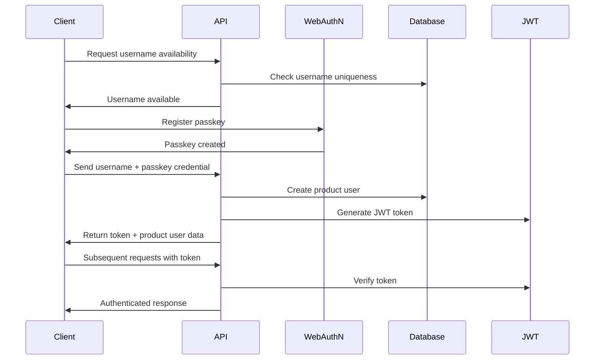

# Backend Architecture

## Service Architecture

### Server Actions Organization

```
src/
├── actions/               # Server actions
│   ├── auth.ts            # Authentication server actions
│   ├── programs.ts        # Program management actions
│   ├── workouts.ts        # Workout execution actions
│   └── exercises.ts       # Exercise management actions
```

### Server Action Template

```typescript
'use server'

import { getPayload } from 'payload'
import { getCurrentUser } from '@/lib/auth'
import { validateData } from '@/lib/validation'
import { revalidatePath } from 'next/cache'

export async function serverActionName(data: ActionData) {
  try {
    // Authentication
    const productUser = await getCurrentProductUser()
    if (!productUser) {
      throw new Error('Unauthorized')
    }

    // Validation
    const validatedData = validateData(data, schema)

    // Business logic
    const payload = await getPayload()
    const result = await payload.create({
      collection: 'collectionName',
      data: validatedData,
    })

    // Revalidate relevant paths
    revalidatePath('/relevant-path')

    return { success: true, data: result }
  } catch (error) {
    console.error('Server Action Error:', error)
    return { success: false, error: error.message }
  }
}
```

## Database Architecture

### PayloadCMS Integration with Embedded Schema

The backend architecture leverages PayloadCMS's collection system with an **embedded document architecture** for optimal performance and simplified data management. The embedded schema consolidates program structure into single documents, eliminating the need for separate milestone and session collections.

**Key Benefits:**

- **Single Source of Truth:** All program structure lives within the Programs collection
- **Atomic Operations:** Update entire program in one operation
- **Data Locality:** Related data lives together for optimal queries
- **Simplified Admin UX:** No more bouncing between collections

### PayloadCMS Local API Data Access

```typescript
import { getPayload } from 'payload'

// PayloadCMS Local API provides full type safety automatically
// No need for custom repository classes - use PayloadCMS methods directly

export async function findUserByUsername(username: string) {
  const payload = await getPayload()

  const result = await payload.find({
    collection: 'productUsers',
    where: {
      username: { equals: username },
    },
    limit: 1,
  })

  return result.docs[0] || null
}

export async function createProductUser(productUserData: Partial<ProductUser>) {
  const payload = await getPayload()

  return await payload.create({
    collection: 'productUsers',
    data: productUserData,
  })
}

export async function updateProductUserProgress(
  productUserId: string,
  progress: Partial<ProductUser>,
) {
  const payload = await getPayload()

  return await payload.update({
    collection: 'productUsers',
    id: productUserId,
    data: progress,
  })
}

export async function findPublishedPrograms() {
  const payload = await getPayload()

  const result = await payload.find({
    collection: 'programs',
    where: { isPublished: { equals: true } },
  })

  return result.docs
}

export async function findProgramById(id: string) {
  const payload = await getPayload()

  return await payload.findByID({
    collection: 'programs',
    id,
  })
}

// Embedded schema program operations - much simpler than normalized approach
export async function createProgram(programData: Partial<Program>) {
  const payload = await getPayload()

  return await payload.create({
    collection: 'programs',
    data: {
      name: programData.name,
      description: programData.description,
      objective: programData.objective,
      milestones: programData.milestones || [],
      isPublished: false,
    },
  })
}

export async function updateProgram(programId: string, programData: Partial<Program>) {
  const payload = await getPayload()

  return await payload.update({
    collection: 'programs',
    id: programId,
    data: programData,
  })
}

export async function publishProgram(programId: string) {
  const payload = await getPayload()

  // Get current program to validate completeness
  const program = await payload.findByID({
    collection: 'programs',
    id: programId,
  })

  // Validate program is complete (validation handled by PayloadCMS hooks)
  return await payload.update({
    collection: 'programs',
    id: programId,
    data: { isPublished: true },
  })
}

// Exercise completion tracking (unchanged from original)
export async function createExerciseCompletion(completionData: Partial<ExerciseCompletion>) {
  const payload = await getPayload()

  return await payload.create({
    collection: 'exerciseCompletions',
    data: completionData,
  })
}

export async function findExerciseCompletionsByUser(productUserId: string) {
  const payload = await getPayload()

  const result = await payload.find({
    collection: 'exerciseCompletions',
    where: {
      productUser: { equals: productUserId },
    },
    sort: '-completedAt',
  })

  return result.docs
}
```

## Authentication Architecture

### Auth Flow



### WebAuthN Integration

```typescript
import {
  generateRegistrationOptions,
  verifyRegistrationResponse,
  generateAuthenticationOptions,
  verifyAuthenticationResponse,
} from '@simplewebauthn/server'

export async function registerPasskey(username: string, credential: any) {
  const payload = await getPayload()

  // Create product user with username
  const productUser = await payload.create({
    collection: 'productUsers',
    data: {
      username,
      passkeyCredentials: [credential],
    },
  })

  return { success: true, productUser }
}

export async function authenticateWithPasskey(username: string, credential: any) {
  const payload = await getPayload()

  // Find user by username
  const result = await payload.find({
    collection: 'productUsers',
    where: { username: { equals: username } },
    limit: 1,
  })

  const productUser = result.docs[0]
  if (!productUser) {
    throw new Error('User not found')
  }

  // Verify passkey credential
  const verification = await verifyAuthenticationResponse({
    response: credential,
    expectedChallenge: expectedChallenge,
    expectedOrigin: process.env.NEXT_PUBLIC_APP_URL,
    expectedRPID: process.env.WEBAUTHN_RP_ID,
    authenticator: productUser.passkeyCredentials[0],
  })

  if (verification.verified) {
    const token = signJWT({ productUserId: productUser.id })
    return { success: true, productUser, token }
  }

  throw new Error('Authentication failed')
}
```

### Middleware/Guards

```typescript
import jwt from 'jsonwebtoken'
import { NextApiRequest, NextApiResponse } from 'next'
import { ProductUser } from '@/types'

interface AuthRequest extends NextApiRequest {
  productUser?: ProductUser
}

export const authMiddleware = async (
  req: AuthRequest,
  res: NextApiResponse,
): Promise<ProductUser | null> => {
  try {
    const token = req.headers.authorization?.replace('Bearer ', '')

    if (!token) {
      return null
    }

    const decoded = jwt.verify(token, process.env.JWT_SECRET!) as any
    const payload = await getPayload()

    const productUser = await payload.findByID({
      collection: 'productUsers',
      id: decoded.productUserId,
    })

    if (!productUser) {
      return null
    }

    req.productUser = productUser
    return productUser
  } catch (error) {
    return null
  }
}

export const requireAuth = (handler: Function) => {
  return async (req: AuthRequest, res: NextApiResponse) => {
    const productUser = await authMiddleware(req, res)

    if (!productUser) {
      return res.status(401).json({ error: 'Unauthorized' })
    }

    return handler(req, res)
  }
}
```

## Type System Architecture

### PayloadCMS Generated Types

PayloadCMS automatically generates TypeScript types from collection schemas:

```typescript
// Auto-generated from PayloadCMS collections
export interface Program {
  id: string
  name?: string
  description?: string
  objective?: string
  milestones?: Milestone[]
  isPublished?: boolean
  createdAt: string
  updatedAt: string
}

export interface Milestone {
  id?: string
  name?: string
  theme?: string
  objective?: string
  days?: Day[]
}

export interface Day {
  id?: string
  dayType: 'workout' | 'rest'
  isAmrap?: boolean // AMRAP (As Many Rounds As Possible) day designation
  amrapDuration?: number // AMRAP workout duration in minutes (1-120)
  exercises?: ExerciseConfig[]
  restNotes?: string
}

export interface ExerciseConfig {
  id?: string
  exercise: string | Exercise // Exercise relationship
  sets: number
  reps: number
  restPeriod?: number
  weight?: number

  // Time-based exercise fields
  durationValue?: number
  durationUnit?: 'seconds' | 'minutes' | 'hours'

  // Distance-based exercise fields (NEW)
  distanceValue?: number
  distanceUnit?: 'meters' | 'miles'

  notes?: string
}
```

### Type Safety Patterns

**Utility Type Guards:**

```typescript
// src/types/exercise-guards.ts
export function hasDistance(
  exercise: ExerciseConfig,
): exercise is ExerciseConfig & { distanceValue: number; distanceUnit: string } {
  return Boolean(exercise.distanceValue && exercise.distanceUnit)
}

export function hasDuration(
  exercise: ExerciseConfig,
): exercise is ExerciseConfig & { durationValue: number; durationUnit: string } {
  return Boolean(exercise.durationValue && exercise.durationUnit)
}

// src/types/day-guards.ts
export function isAmrapDay(day: Day): day is Day & { isAmrap: true; amrapDuration: number } {
  return Boolean(day.isAmrap && day.amrapDuration)
}

// Usage in components:
if (hasDistance(exercise)) {
  // TypeScript knows distanceValue and distanceUnit are defined
  const display = formatDistance(exercise.distanceValue, exercise.distanceUnit)
}

if (isAmrapDay(day)) {
  // TypeScript knows this is an AMRAP day with duration
  const timerDuration = day.amrapDuration * 60 // Convert to seconds
}
```

## PayloadCMS Configuration Best Practices

### Component Path Resolution (Critical Learning)

**Issue:** Direct React component imports in PayloadCMS config files cause CSS extension errors during `generate:types` and `generate:importmap` commands.

**Root Cause:** PayloadCMS build process cannot handle direct React component imports that may include CSS/SCSS imports.

### ❌ Problematic Pattern

```typescript
// src/payload/collections/exercises.ts
import { ExerciseRowLabel } from '../../components/admin/exercise-row-label'

export const ExercisesCollection: CollectionConfig = {
  slug: 'exercises',
  components: {
    RowLabel: ExerciseRowLabel, // Direct import causes build errors
  },
  // ... rest of config
}
```

**Error Symptoms:**
- `npm run generate:types` fails with CSS extension errors
- `npm run generate:importmap` fails during build process
- Build process cannot resolve React component dependencies

### ✅ Correct Pattern

```typescript
// src/payload/collections/exercises.ts
// No direct component imports needed

export const ExercisesCollection: CollectionConfig = {
  slug: 'exercises',
  components: {
    RowLabel: 'src/components/admin/exercise-row-label#ExerciseRowLabel',
    //         ^^^^^^^^^^^^^^^^^^^^^^^^^^^^^^^^^^^^^^^^^^^^^^^^^^^^^^^^^
    //         String path resolved at runtime by PayloadCMS
  },
  // ... rest of config
}
```

**Path Resolution Rules:**
- Use **absolute paths** from project root (not relative paths)
- Format: `'src/path/to/component#ComponentName'`  
- PayloadCMS resolves these strings at runtime
- No direct imports means no CSS resolution conflicts

### Configuration Workflow

**After Component Path Changes:**
```bash
# 1. Update PayloadCMS config with string paths
# 2. Regenerate import map
npm run generate:importmap

# 3. Regenerate TypeScript definitions
npm run generate:types

# 4. Restart development server
npm run dev
```

### Component Development Guidelines

**Component File Structure:**
```typescript
// src/components/admin/exercise-row-label.tsx
import React from 'react'
import './exercise-row-label.scss' // CSS imports are safe in component files

export const ExerciseRowLabel: React.FC<Props> = ({ doc, ...props }) => {
  return (
    <div className="exercise-row-label">
      {/* Component implementation */}
    </div>
  )
}
```

**PayloadCMS Config File Structure:**
```typescript  
// src/payload/collections/exercises.ts
// NO CSS imports
// NO direct React component imports
// ONLY string-based component references

export const ExercisesCollection: CollectionConfig = {
  slug: 'exercises',
  components: {
    RowLabel: 'src/components/admin/exercise-row-label#ExerciseRowLabel',
  },
}
```

### Build Process Integration

The string-based component resolution integrates with PayloadCMS's build pipeline:

1. **Development:** Components resolved dynamically via string paths
2. **Build Time:** `generate:importmap` creates component mappings
3. **Type Generation:** `generate:types` uses mappings for TypeScript definitions
4. **Runtime:** PayloadCMS loads components using resolved paths

This approach prevents CSS resolution conflicts while maintaining full component functionality and type safety.

```

```
