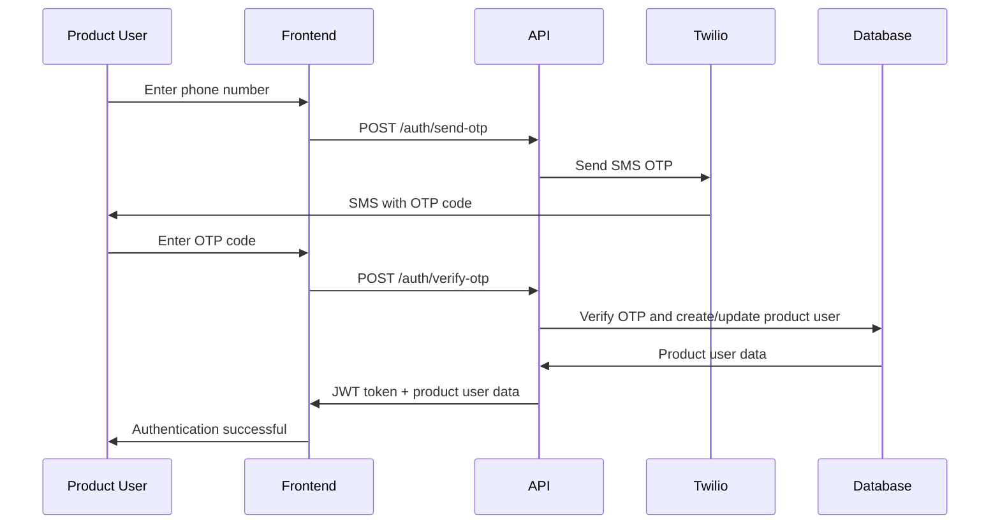
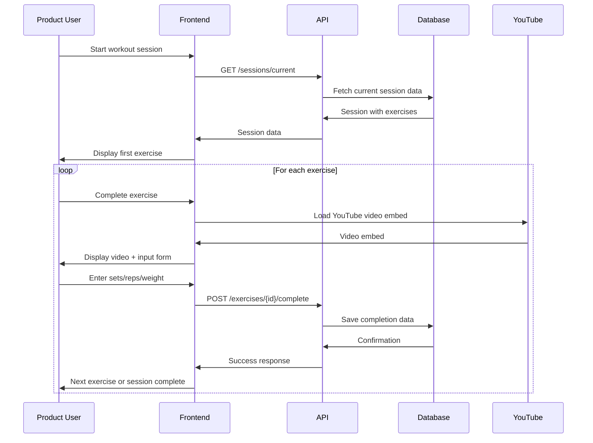
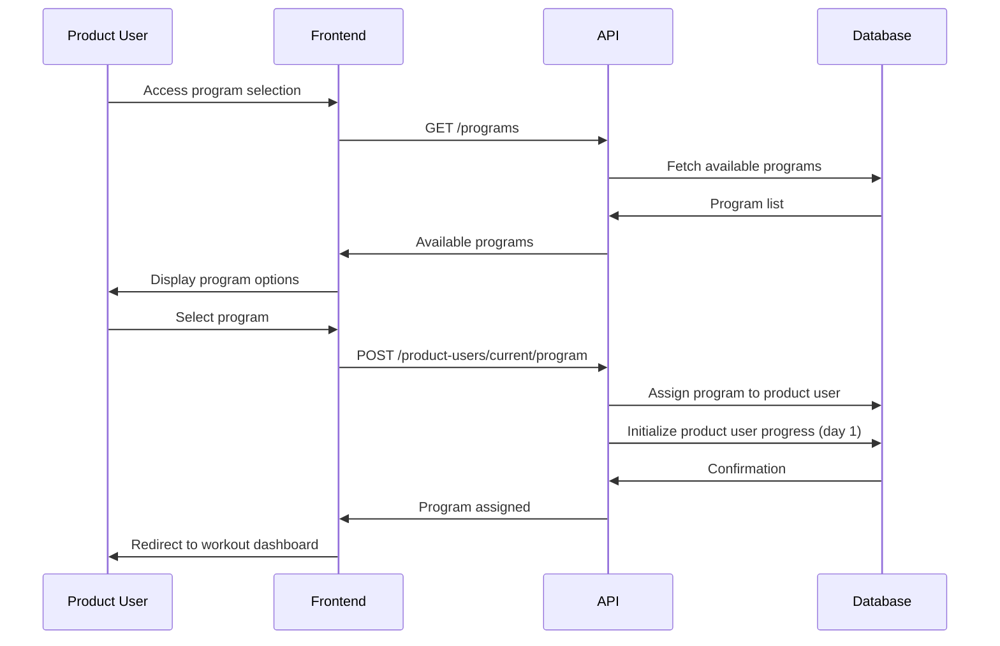

# Core Workflows

## Product User Authentication Workflow

```mermaid
sequenceDiagram
    participant U as Product User
    participant F as Frontend
    participant A as API
    participant T as Twilio
    participant D as Database

    U->>F: Enter phone number
    F->>A: POST /auth/send-otp
    A->>T: Send SMS OTP
    T->>U: SMS with OTP code
    U->>F: Enter OTP code
    F->>A: POST /auth/verify-otp
    A->>D: Verify OTP and create/update product user
    D->>A: Product user data
    A->>F: JWT token + product user data
    F->>U: Authentication successful
```

## Workout Session Execution Workflow

```mermaid
sequenceDiagram
    participant U as Product User
    participant F as Frontend
    participant A as API
    participant D as Database
    participant Y as YouTube

    U->>F: Start workout session
    F->>A: GET /sessions/current
    A->>D: Fetch current session data
    D->>A: Session with exercises
    A->>F: Session data
    F->>U: Display first exercise

    loop For each exercise
        U->>F: Complete exercise
        F->>Y: Load YouTube video embed
        Y->>F: Video embed
        F->>U: Display video + input form
        U->>F: Enter sets/reps/weight
        F->>A: POST /exercises/{id}/complete
        A->>D: Save completion data
        D->>A: Confirmation
        A->>F: Success response
        F->>U: Next exercise or session complete
    end
```

## Program Selection and Initialization Workflow

```mermaid
sequenceDiagram
    participant U as Product User
    participant F as Frontend
    participant A as API
    participant D as Database

    U->>F: Access program selection
    F->>A: GET /programs
    A->>D: Fetch available programs
    D->>A: Program list
    A->>F: Available programs
    F->>U: Display program options
    U->>F: Select program
    F->>A: POST /product-users/current/program
    A->>D: Assign program to product user
    A->>D: Initialize product user progress (day 1)
    D->>A: Confirmation
    A->>F: Program assigned
    F->>U: Redirect to workout dashboard
```
