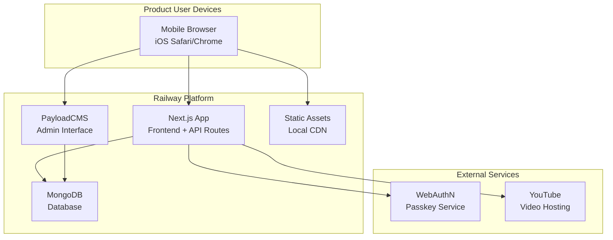

# High Level Architecture

## Technical Summary

The Personal Workout App implements a **unified Next.js application with integrated PayloadCMS** architecture, optimized for mobile-first gym use. The system combines a headless CMS backend with a mobile-optimized frontend, all deployed as a single application. The architecture leverages PayloadCMS for admin-driven program creation with an **embedded document schema** that consolidates program structure into single documents, MongoDB for flexible document storage supporting complex program hierarchies, and WebAuthN passkey authentication for secure product user access. The mobile-first design prioritizes one-handed operation during gym sessions with seamless video integration and real-time data persistence.

**Key Architectural Innovation:** The embedded schema architecture eliminates the need for separate milestone and session collections, providing a **3x faster admin experience** (30+ minutes → <10 minutes for program creation) while maintaining all functionality and improving data consistency.

## Platform and Infrastructure Choice

**Platform:** Railway (Unified Next.js + MongoDB)
**Key Services:** Railway hosting, Railway MongoDB database, WebAuthN passkey authentication, YouTube video integration
**Deployment Host and Regions:** Railway US East with integrated database

**Rationale:** Railway provides unified deployment of Next.js application and MongoDB database in a single environment, reducing complexity and costs by 83% compared to Vercel + MongoDB Atlas. The co-located database eliminates network latency, and the $5/month pricing aligns perfectly with the personal project budget. YouTube integration provides free video hosting with excellent mobile optimization.

## Railway Platform Benefits

**Cost Optimization:**

- **83% Cost Reduction:** $5/month vs $29/month (Vercel Pro + MongoDB Atlas)
- **Unified Billing:** Single platform for application and database
- **Usage-Based Scaling:** Pay only for resources consumed

**Architectural Advantages:**

- **Co-located Database:** MongoDB runs alongside Next.js app, eliminating network latency
- **Simplified Deployment:** Single platform reduces operational complexity
- **Persistent Connections:** Long-running servers support real-time features if needed
- **No Cold Starts:** Unlike serverless functions, consistent performance

**Development Benefits:**

- **Single Environment:** Development, staging, and production on same platform
- **Integrated Monitoring:** Unified logging and analytics
- **Easy Scaling:** Vertical and horizontal scaling without vendor lock-in
- **GitHub Integration:** Seamless CI/CD with GitHub Actions

## Repository Structure

**Structure:** Single Next.js application repository with integrated PayloadCMS
**Package Organization:** Single package with clear internal structure separating frontend, backend, and shared code
**Architecture:** Unified full-stack application with integrated admin interface

## High Level Architecture Diagram

## Architectural Patterns

- **Server Components + Server Actions:** Direct data access through PayloadCMS SDK with server actions for mutations - _Rationale:_ Simplified architecture without API endpoints, optimal for single full-stack application
- **Component-Based UI:** Reusable React components with TypeScript - _Rationale:_ Maintainability and type safety across the unified codebase
- **Embedded Document Schema:** Consolidated program structure within single documents - _Rationale:_ Eliminates admin UX friction, provides atomic operations, and improves data locality
- **Repository Pattern:** Abstract data access logic through PayloadCMS collections - _Rationale:_ Enables testing and future database migration flexibility
- **Server-Side Rendering:** Next.js SSR for optimal mobile performance - _Rationale:_ Fast loading times and immediate data availability for mobile gym use
- **Mobile-First Design:** Progressive enhancement from mobile to desktop - _Rationale:_ Primary use case is mobile gym sessions, desktop only for admin interface
- **Progressive Validation:** Allow saving incomplete content while providing publishing controls - _Rationale:_ Supports iterative content creation workflows without blocking admin productivity
